# meridian — Weather Dashboard

Multi-city weather dashboard: search places, **pin** them from city detail, see current conditions and forecasts, and keep your list across reloads (localStorage). Built with Next.js and OpenWeather’s free tier — with caching and quota limits so a local demo does not burn the daily call budget.

This is a **responsive website** for phones and desktops. Footer store badges hint at a possible native-app future; they are not shipped App Store / Play apps.

**Live site:** [https://meridianweather.co.uk](https://meridianweather.co.uk)

**Further reading:** [SCOPE.md](SCOPE.md) (what must work vs stretch) · [REVIEWER.md](REVIEWER.md) (5-minute walkthrough) · [docs/STUDY-BACKEND.md](docs/STUDY-BACKEND.md) (cache, quota, API flow)


## Requirements

| Need | Notes |
| --- | --- |
| **Node.js** | 20+ recommended (Next.js 16) |
| **npm** | Comes with Node |
| **OpenWeather API key** | Free tier — [openweathermap.org/api](https://openweathermap.org/api). Required to load live weather. |
| **Build tools** | `better-sqlite3` compiles a native addon — Python 3 + `make`/`g++` (Linux/macOS), or Visual Studio Build Tools (Windows) |

Optional keys (Unsplash, email ESPs, AdSense, admin, cron) power stretch features. The core demo runs with **only** `OPENWEATHER_API_KEY`.

## Quick start

```bash
git clone https://github.com/didgitUK/meridianweather.git
cd meridianweather
cp .env.example .env.local
```

Edit `.env.local` and set:

```bash
OPENWEATHER_API_KEY=your_key_here
```

Then:

```bash
npm install
npm run dev
```

Open [http://localhost:3000](http://localhost:3000).

### Smoke test

1. Search a city (e.g. London) → open city detail → **Pin** → card appears under **Your locations**.
2. Reload — the city stays pinned.
3. Unpin — empty-state guidance returns.
4. Optional: `npm run test` for the unit suite.

## Design choices

- **Header search, no site nav** — find a place immediately.
- **Ads in the first viewport** — square + banner high on home/city (demo placeholders until AdSense env + advertising consent).
- **Pin → toast → Your locations** — preview on city detail, then save with clear feedback.
- **7 locales** (`en`, `en-GB`, `de`, `fr`, `es`, `ja`, `ar`); US English (`en`) defaults to **°F**, others to **°C**.
- **Location-aware** — reverse-IP / region hint, confirm dialog, map-style hero when resolved.
- **Email updates** — weekly digest + alerts; **22** optional alert types (needs an email connector to actually send).
- **Cookies + accessibility** — Settings sheet.
- **Legal + journal** — in-product policies and long-form posts (SEO + trust); schema-style side anchors.
- **Discovery** — `/robots.txt` and `/sitemap.xml` are generated by the app. Set `NEXT_PUBLIC_APP_URL` when you deploy so absolute URLs are correct.

## Product gallery

### City options & pin feedback

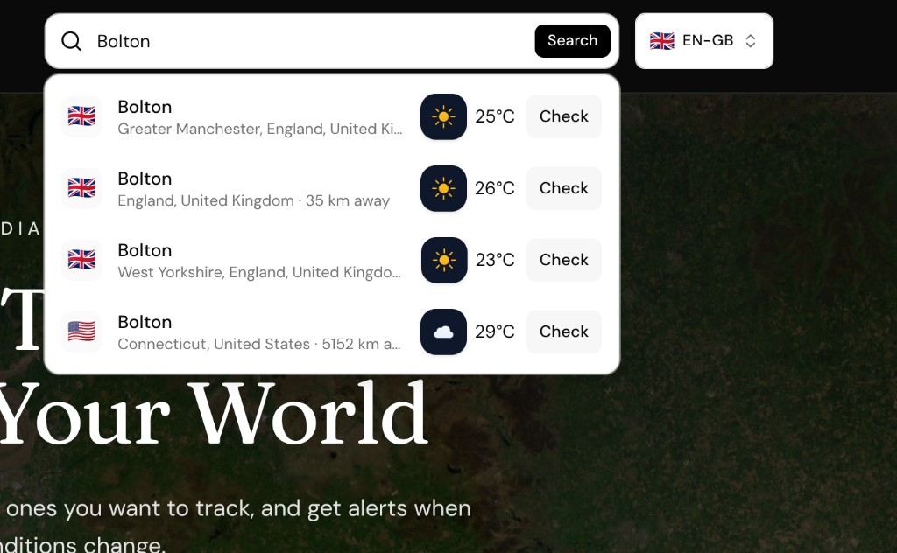

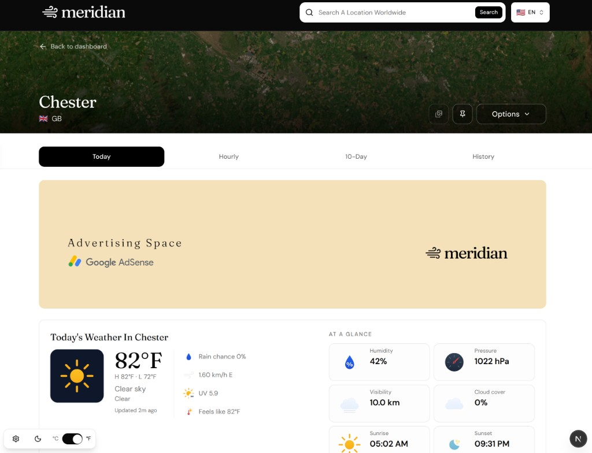

### Locales

German and Spanish:

<p>
  
  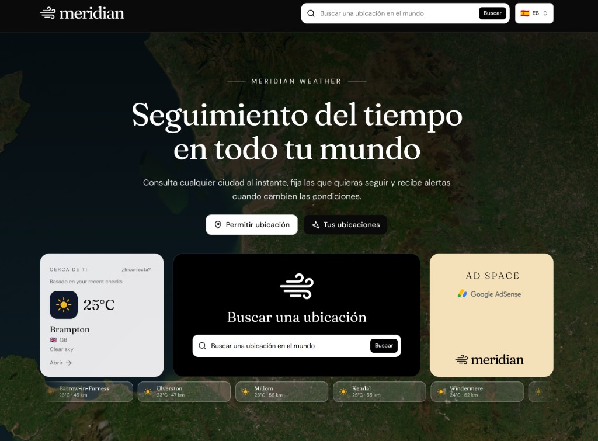
</p>

French and Japanese:

<p>
  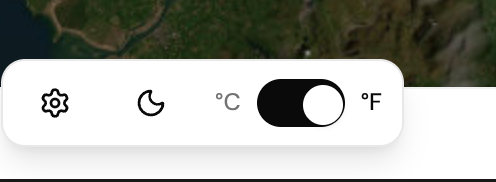
  
</p>

### Location & floating controls

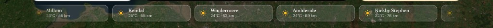

### Ads in the viewport

Live AdSense needs publisher/slot env vars **and** advertising consent. Until then, branded creatives from `public/ads/` fill the slots.

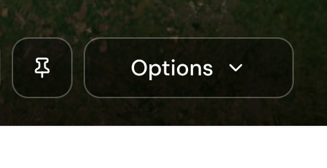

### City detail load & tabs

First paint may wait on upstream weather + hero; later loads benefit from browser (L0), memory (L1), and SQLite (L2) caches. Detail tabs cover Today / Hourly / 10-Day / History.

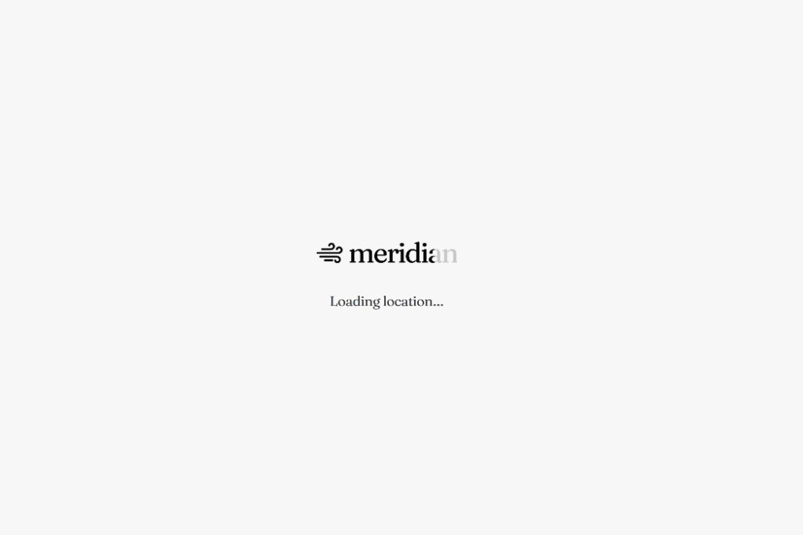

### Your locations

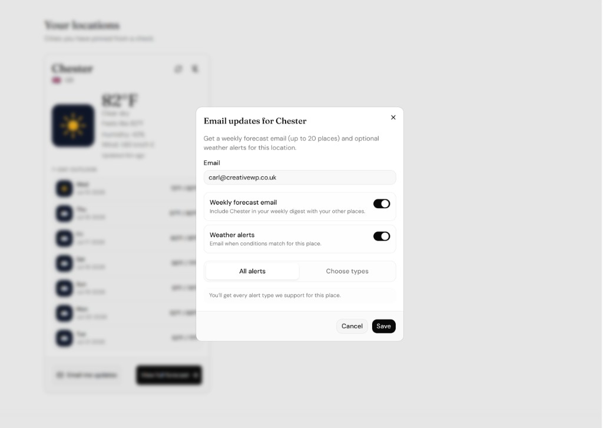

### Email updates

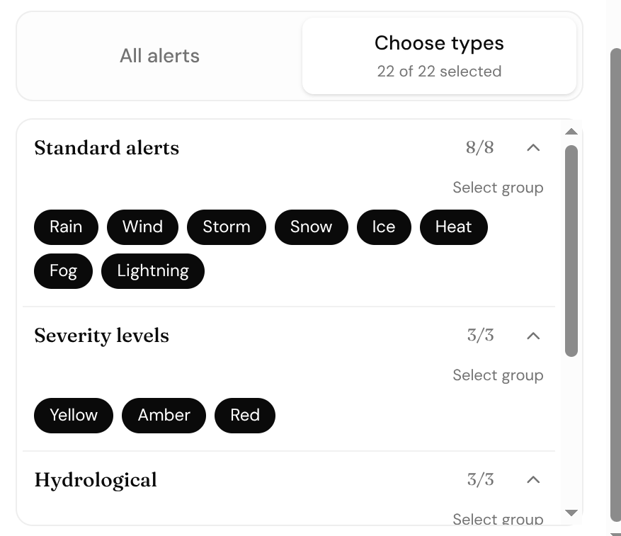

### Cookies & accessibility

**Accept all** enables functional + advertising (analytics stays opt-in). Before any choice, advertising starts **off**.

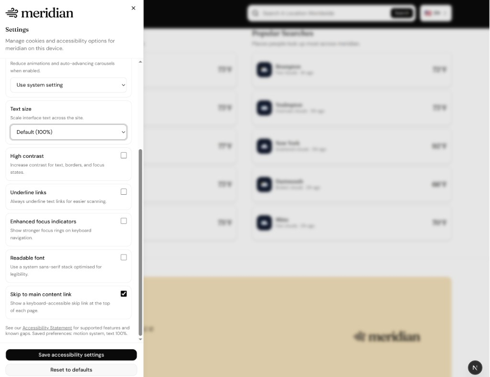

## Legal & trust

Privacy, cookies, terms, and accessibility pages ship as product templates (not legal advice). Sidebars use the same schema / in-this-article anchors as journal posts.


## Journal & SEO

City pages are useful but thin. Journal posts add archive depth, images, and internal links — more indexable URLs beyond “weather in X.”

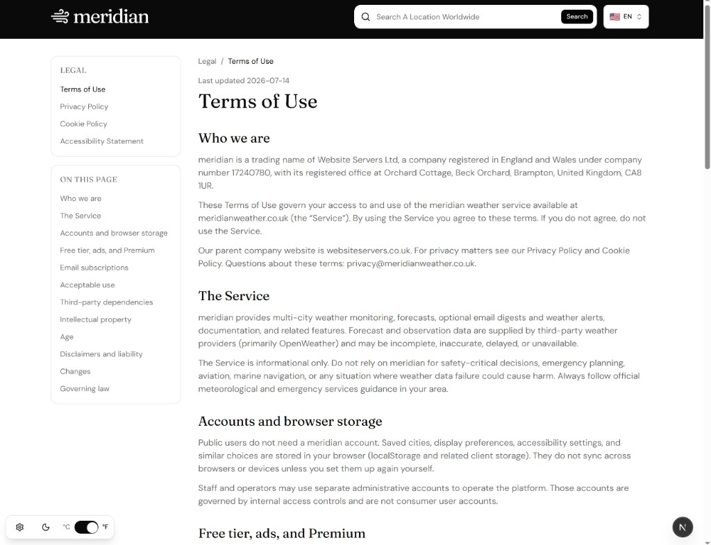

Crawl discovery: [`src/app/robots.js`](src/app/robots.js) → `/robots.txt`, [`src/app/sitemap.js`](src/app/sitemap.js) → `/sitemap.xml` (locales, docs, legal, journal, search, indexable cities).

## Devices vs apps

Mobile- and desktop-optimised **web**. Store badges are roadmap placeholders only.

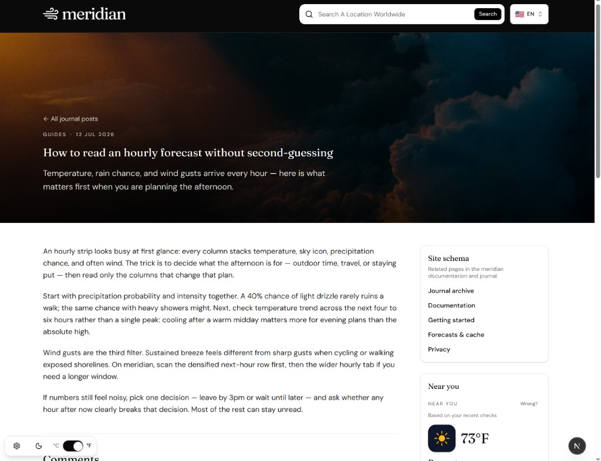

---

## Troubleshooting install

`better-sqlite3` is a **core** dependency (L2 cache, quota, platform settings). It compiles a native addon.

| | |
| --- | --- |
| **Symptom** | `npm install` fails while building `better-sqlite3` |
| **Fix** | Install the native toolchain, then `rm -rf node_modules && npm install` |
| **After install** | SQLite file auto-creates under `./data/` (gitignored) |

`postinstall` also copies Meteocons SVGs into `public/weather-icons/`.

If weather cards fail after install, check that `.env.local` has a valid `OPENWEATHER_API_KEY` and restart `npm run dev`.

## Approach

1. **Next.js App Router** with **API routes** that proxy OpenWeather (API key stays server-side).
2. **localStorage** for the user’s pinned city list.
3. **Caching** (browser L0 + memory L1 + SQLite L2) and a daily quota tracker (default 1000/day, 60/min; warning 800; soft-block 950).
4. **JavaScript** (not TypeScript). Public UI ships **7 locales** via `next-intl`; admin/auth stay English-first.
5. Stretch features (admin, email, AdSense) are optional. Local admin bypass: `ALLOW_DEV_ADMIN_BYPASS=1` with `NODE_ENV=development` and no `ADMIN_SECRET`. Cron is fail-closed in production when `CRON_SECRET` is unset.

## Assumptions & decisions

- City “add” is **pin from city detail** after search (preview before saving).
- Default weather refresh mode is **manual** (`meridian:weather-refresh-mode`) — cards reuse local cache until refresh.
- Functional cookie consent gates **localStorage** writes to `meridian:weather-cache` (in-memory session cache still works).
- Hero photos cascade Unsplash → Wikimedia Commons (keyless) → Pexels; static SVGs in `public/hero/` are last resort.
- Without AdSense env/consent, slots show branded demo placeholders in `public/ads/`.
- Home ads + journal teaser are **on by default**; set `NEXT_PUBLIC_SHOW_HOME_STRETCH=0` for a leaner UI focused on search → pin → cards.
- Popular-searches strip can seed showcase cities when empty (`NEXT_PUBLIC_SHOW_DEMO_POPULAR_SEARCHES=0` disables that).
- Set `NEXT_PUBLIC_APP_URL` in production for SEO canonicals, sitemap/robots host, email unsubscribe, invite/reset links, and AdSense OAuth callback fallback.

## Environment

| Variable | Purpose |
| --- | --- |
| `OPENWEATHER_API_KEY` | **Required** — weather and primary geocode |
| `UNSPLASH_ACCESS_KEY` | Optional — live location hero photos |
| `PEXELS_API_KEY` | Optional — third hero provider after Unsplash + Wikimedia |
| `DATABASE_PATH` | SQLite path (default `./data/meridian.db`) |
| `RESEND_*` / `SENDGRID_*` / `AWS_*` / `SMTP_*` | Optional email connectors |
| `NEXT_PUBLIC_APP_URL` | Production base URL (SEO, email links, invites) |
| `NEXT_PUBLIC_GA_MEASUREMENT_ID` | Optional — GA4 (requires analytics consent) |
| `NEXT_PUBLIC_GOOGLE_MAPS_API_KEY` | Optional — Street View hero embed |
| `CRON_SECRET` | Bearer for `/api/cron/*` (**required in production** if cron is used) |
| `ADMIN_SECRET` | Session HMAC + connector encryption (**required** for admin login cookies) |
| `ADMIN_PASSWORD` / `ADMIN_EMAIL` | Root admin login |
| `ALLOW_DEV_ADMIN_BYPASS` | Optional `1` — local admin bypass (dev only; see above) |
| `GOOGLE_ADSENSE_*` | Optional — AdSense publisher / slots / OAuth |

Full list: [`.env.example`](.env.example). Admin session cookie: `meridian_admin_session`. First-party analytics + GA4 require analytics consent (see Cookie Policy).

## Deploy

Any Node host that can build native modules and keep a writable SQLite path works. **Vercel** is a common choice (use persistent storage for `DATABASE_PATH` when available).

| Env | Core | Notes |
| --- | --- | --- |
| `OPENWEATHER_API_KEY` | Required | Weather/geocode fail closed without it |
| `NEXT_PUBLIC_APP_URL` | Required in prod | Canonicals, sitemap/robots, email/unsubscribe, invites |
| `DATABASE_PATH` | Recommended | Ephemeral disk resets cache/quota/subscriptions on redeploy |

Stretch env (only if those surfaces matter): `ADMIN_*`, `CRON_SECRET`, AdSense keys, email provider keys. Hide home ads/journal with `NEXT_PUBLIC_SHOW_HOME_STRETCH=0`.

```bash
npm run build
npm run start
```

## Scripts

| Command | Description |
| --- | --- |
| `npm run dev` | Development server |
| `npm run build` then `npm run start` | Production |
| `npm run test` | Vitest unit tests |
| `npm run lint` | ESLint |
| `npm run verify` | Lint + test + build |
| `npm run copy:icons` | Copy Meteocons → `public/weather-icons/` (also `postinstall`) |
| `npm run seed:checks` | Seed North England `weather_snapshots` (L2 cache demo — not the popular-searches strip) |
| `npm run backfill:city-slugs` | Backfill location slugs |
| `npm run audit:deps` | `npm audit --omit=dev` |

## Features

### Core

- City search → city detail → **pin/unpin**, localStorage persistence, empty-state guidance
- Weather cards: temperature, description, humidity, wind, **Meteocons** icons; detail view for fuller metrics and forecasts
- Loading and error states; API key via env; Next.js proxies OpenWeather (`/api/weather`, `/api/weather/batch`, `/api/geocode`, `/api/platform/limits`)
- Caching + quota tracking (1000/day default)
- Responsive layout; 7 public locales

### Stretch (optional — see SCOPE.md)

- Hero photos, near-you / popular-searches strips, city detail forecasts/alerts, journal
- Newsletter / digests / alerts (Resend, SendGrid, SES, or SMTP + cron), AdSense (or demo placeholders)
- Admin at `/login` → `/admin`, legal + docs pages, first-party analytics + optional GA4

## Known limitations / next steps

- Premium / minutely precipitation UI is not wired (tier is always free).
- Email and cron need external config (`CRON_SECRET` + a connector); there is no in-repo scheduler.
- Legal pages are demo templates, not counsel.
- Store badges are not published native apps.

## Documentation map

| Doc | Use when |
| --- | --- |
| [REVIEWER.md](REVIEWER.md) | Walking the demo or mapping criteria to files |
| [SCOPE.md](SCOPE.md) | Core vs freeze / stretch boundaries |
| [docs/STUDY-BACKEND.md](docs/STUDY-BACKEND.md) | Lifecycle, errors, cache TTLs |
| [docs/ARCHITECTURE.md](docs/ARCHITECTURE.md) | Folder map and data flows |
| [docs/DECISIONS.md](docs/DECISIONS.md) | Why choices were made (ADRs) |
| [docs/SECURITY.md](docs/SECURITY.md) | Threat model and production checklist |
| [docs/DATA-INVENTORY.md](docs/DATA-INVENTORY.md) | What is stored client- vs server-side |
| [docs/EMAIL-TEMPLATE-SHORTCODES.md](docs/EMAIL-TEMPLATE-SHORTCODES.md) | Email template tokens |

## Stack

Next.js 16 (App Router), React 19, **JavaScript**, Tailwind CSS v4, ShadCN UI, Vitest, Meteocons icons, **SQLite (`better-sqlite3`)** for cache/quota. Stretch: multi-ESP email + React Email, Google AdSense, `next-intl`.
