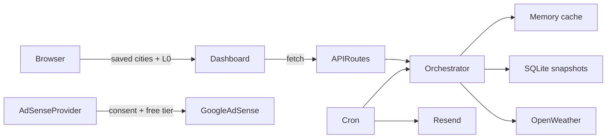

# Architecture

## Overview

meridian is a Next.js 16 App Router application (JavaScript). The browser stores user preferences (cities, theme, consent, tier, weather L0 cache). Server routes proxy OpenWeather, enforce quota limits, persist weather snapshots in SQLite, send email via Resend, and serve AdSense configuration.

## Folder map

| Path | Responsibility |
| --- | --- |
| `src/app/` | Routes, API handlers, layouts, `ads.txt` |
| `src/features/` | Domain UI: weather, cities, subscriptions, admin |
| `src/lib/weather/` | Cache policy, upstream strategies, persist, contracts, recent checks |
| `src/lib/geocode/` | Geocode public barrel (ranking/enrichment peers + fetch) |
| `src/lib/location/` | Location/city resolve barrel |
| `src/lib/client/` | Browser helpers (`fetch-json`) |
| `src/lib/server/` | Auth, API envelope, env checks, adsense |
| `src/lib/` | DB, shared utils, thin orchestrator facade |
| `src/hooks/` | Client hooks (`use-browser-storage`, `use-now`, scroll header) |
| `src/components/` | Shared UI, layout, monetization, docs templates |
| `src/providers/` | Theme, consent, AdSense, privacy preferences |
| `src/constants/` | Weather TTLs, storage keys, monetization, seed locations |
| `src/content/` | Legal and user documentation prose |
| `src/emails/` | React Email templates |
| `src/design-system/` | CSS tokens and themes |
| `scripts/` | `seed-recent-checks.mjs`, `copy-weather-icons.mjs` |
| `public/weather-icons/` | Meteocons SVG assets (MIT) |

## API error envelope

Route handlers return `{ error, message }` via `src/lib/server/api-response.js`. Prefer codes: `invalid_request`, `rate_limited`, `unauthorized`, `upstream_error`.

## Data flow — weather request

1. Client `useWeatherData` / `useCityWeather` reads L0 from `localStorage`.
2. Client requests `GET /api/weather` or `POST /api/weather/batch`.
3. `weather-fetch-orchestrator` (facade → `lib/weather/fetch-scope`) dedupes in-flight fetches via `pendingFetches` Map.
4. Checks L1 memory, then L2 SQLite by `buildSnapshotKey(lat, lon, scope)`.
5. Classifies freshness: `fresh`, `acceptable`, `expired`, or serves `emergency` stale when quota blocked.
6. `api-usage-tracker` enforces daily (1000) and per-minute (60) limits before upstream.
7. OpenWeather One Call 4.0; current falls back to 2.5. Geocode and alert scopes are server-only.
8. `writeSnapshot` upserts SQLite; client updates L0.

## Data flow — recent checks

1. `GET /api/recent-checks` calls `listRecentPlatformChecks(40)`.
2. Dedupes by rounded lat/lon from `weather_snapshots` where `scope = current`.
3. If empty, hydrates four `PLATFORM_SHOWCASE_CITIES` via orchestrator.
4. `npm run seed:checks` writes North England demo snapshots with staggered timestamps.

## Data flow — subscriptions

1. User submits via `SubscribeModal` or `NewsletterSignup`.
2. `POST /api/subscriptions` writes SQLite; client updates `meridian:subscriptions`.
3. Cron routes reuse orchestrator snapshots; Resend sends templates when keyed.
4. `subscription_send_log` dedupes weather alert emails.

## Data flow — advertising

1. `AdSenseProvider` fetches `GET /api/ads/config` once.
2. If free tier + `consent.advertising` + valid env client ID, loads AdSense script once.
3. `AdSlot` components fetch per-placement config and push `adsbygoogle` units when slot IDs set.

### AdSense Management API (admin earnings)

1. Admin connects Google OAuth (`/api/admin/adsense/oauth/*`) with `adsense.readonly` scope.
2. Refresh token stored encrypted on `platform_settings`; account metadata cached.
3. Sync pulls date / page / platform / country reports into `adsense_report_snapshots`.
4. Admin AdSense section charts KPIs from `GET /api/admin/adsense/report` (stale-after-6h auto-refresh).

## Database schema

SQLite (`src/lib/db/index.js`):

| Table | Purpose |
| --- | --- |
| `weather_snapshots` | L2 cache; unique `cache_key` |
| `api_call_log` | Quota audit (hit vs upstream) |
| `subscriptions` | Email opt-ins |
| `subscription_send_log` | Alert dedup |
| `platform_settings` | Singleton refresh interval, limits, AdSense OAuth |
| `adsense_report_snapshots` | Cached Management API report rows by range + dimension |

## Layer rules

- **No OpenWeather key in client** — all upstream calls server-side.
- **Features do not import DB on client** — API routes or server lib only.
- **Hooks own client state** — components stay presentational where possible.
- **Icons local** — Meteocons in `public/weather-icons/`, mapped from OpenWeather codes.

## Middleware

`src/middleware.js` rewrites `docs.localhost` → `/docs` for local documentation subdomain.

## User documentation

In-app docs at `/docs/*` — pages sourced from `src/content/docs/` via dynamic `[slug]` route. See `DOCS_PAGES` in `src/content/docs/index.js`.
