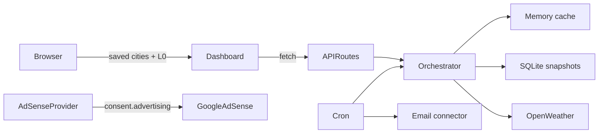

# Architecture

## Overview

meridian is a Next.js 16 App Router application (JavaScript). The browser stores user preferences (cities, theme, consent, weather L0 cache, and related settings). Runtime tier is always free (`meridian:tier` is reserved/unused). Server routes proxy OpenWeather, enforce quota limits, persist weather snapshots and platform settings in SQLite, send email via the active connector (Resend, SendGrid, SES, or SMTP), ingest first-party analytics when `consent.analytics` is on, and serve AdSense configuration.

## Folder map

| Path | Responsibility |
| --- | --- |
| `src/app/` | Routes, API handlers, layouts; `ads.txt` via `src/app/ads.txt/route.js` |
| `src/features/` | Domain UI: weather, cities, subscriptions, admin |
| `src/lib/weather/` | Cache policy, upstream strategies, persist, contracts, recent checks |
| `src/lib/geocode/` | Geocode public barrel (ranking/enrichment peers + fetch) |
| `src/lib/location/` | Location/city resolve barrel |
| `src/lib/client/` | Browser helpers (`fetch-json`) |
| `src/lib/server/` | Auth, API envelope, env checks, adsense |
| `src/lib/` | DB, shared utils, thin orchestrator facade |
| `src/hooks/` | Client hooks (`use-browser-storage`, `use-now`, scroll header) |
| `src/components/` | Shared UI, layout, monetization, docs templates |
| `src/providers/` | Theme, consent, AdSense, settings, accessibility, temperature unit, weather refresh mode |
| `src/constants/` | Weather TTLs, storage keys, monetization, seed locations |
| `src/content/` | Legal and user documentation prose |
| `src/emails/` | React Email templates |
| `src/design-system/` | CSS tokens and themes |
| `scripts/` | `seed-recent-checks.mjs`, `copy-weather-icons.mjs`, `backfill-city-slugs.mjs` |
| `public/weather-icons/` | Meteocons SVG assets (MIT) |

## API error envelope

Route handlers return `{ error, message }` via `src/lib/server/api-response.js`. Prefer codes: `invalid_request`, `rate_limited`, `unauthorized`, `upstream_error`.

## Data flow — weather request

1. Client `useWeatherData` / `useCityWeather` reads L0 from `localStorage`.
2. Client requests `GET /api/weather` or `POST /api/weather/batch`.
3. `weather-fetch-orchestrator` (facade → `lib/weather/fetch-scope`) dedupes in-flight fetches via `pendingFetches` Map.
4. Checks L1 memory, then L2 SQLite by `buildSnapshotKey(lat, lon, scope[, lang])` (non-`en` appends `,{lang}`).
5. Classifies freshness: `fresh`, `acceptable`, `expired`, or serves `emergency` stale when quota blocked.
6. `api-usage-tracker` enforces daily (1000; warning 800; soft-block 950) and per-minute (60) limits before upstream (overridable via `platform_settings`).
7. OpenWeather One Call 4.0; current falls back to 2.5. Geocode and alert scopes are server-only.
8. `writeSnapshot` upserts SQLite; client updates L0.

## Data flow — recent checks

1. Home UI (`RecentChecksSection`) shows two columns (up to **5** cards each): **Near you** (nearby places from the home location + current weather batch) and **Popular searches**.
2. Popular searches data: `GET /api/recent-checks` → `getRecentChecksPayload()` → `listPopularSearchChecks` on `location_weather_checks` (triggers `search_select` / `search_preview`), default limit **20**, `{ checks, source: popular|empty }`. The **API** has no showcase fallback.
3. When the API returns empty and `SHOW_DEMO_POPULAR_SEARCHES` is true (default; disable with `NEXT_PUBLIC_SHOW_DEMO_POPULAR_SEARCHES=0`), the **UI** fills Popular searches from `PLATFORM_SHOWCASE_CITIES`.
4. `npm run seed:checks` writes North England `weather_snapshots` for cache demos — it does **not** populate `/api/recent-checks`.

## Data flow — subscriptions

1. User submits via `SubscribeModal` or `NewsletterSignup`.
2. `POST /api/subscriptions` writes SQLite; client updates `meridian:subscriptions`.
3. Cron routes reuse orchestrator snapshots; the active email connector sends templates when configured.
4. `subscription_send_log` dedupes weather alert emails.

## Data flow — advertising

1. `AdSenseProvider` fetches `GET /api/ads/config` once.
2. If `consent.advertising` + valid env client ID, loads AdSense script once (runtime tier is always free; `meridian:tier` is unused).
3. `AdSlot` components fetch per-placement config and push `adsbygoogle` units when slot IDs set.

### AdSense Management API (admin earnings)

1. Admin connects Google OAuth (`/api/admin/adsense/oauth/*`) with `adsense.readonly` scope.
2. Refresh token stored encrypted on `platform_settings`; account metadata cached.
3. Sync pulls date / page / platform / country reports into `adsense_report_snapshots`.
4. Admin AdSense section charts KPIs from `GET /api/admin/adsense/report` (stale-after-6h auto-refresh).

## Database schema

SQLite (`src/lib/db/index.js`) — core plus stretch tables:

| Table | Purpose |
| --- | --- |
| `weather_snapshots` | L2 cache; unique `cache_key` |
| `api_call_log` | Quota audit (hit vs upstream) |
| `subscriptions` | Email opt-ins (newsletter / weekly / alerts) |
| `subscription_send_log` | Alert dedup |
| `platform_settings` | Singleton refresh interval, limits, connectors, AdSense OAuth, digest defaults |
| `adsense_report_snapshots` | Cached Management API report rows by range + dimension |
| `locations` / `location_weather_checks` | Admin location history and check audit |
| `admin_users` / admin invite+reset tokens | Admin accounts and auth flows |
| `email_templates` | Editable branded HTML templates |
| `hero_image_cache` | Dual-orientation photo URLs (journal / photo-mode; map heroes use Esri) |
| `cms_pages` | Editable legal/docs copy |
| `blog_posts` | Editable journal articles (EN CMS; seed from `HOME_BLOG_POSTS`) |
| `site_analytics_events` | First-party analytics (beacon ingest) |
| `admin_audit_log` | Admin action audit trail |
| `error_events` | Durable error/warn events (API 5xx, cron, client boundary) |
| `process_runs` | Cron job runs (weather-alerts, weekly-digests) |
| `email_send_log` | Transactional email attempts (redacted recipient) |
| `weather_observations` | Upstream-only observation archive |
| `weather_forecast_archive` | Forecast archive rows |

Additional migrations may exist; treat `src/lib/db/index.js` as source of truth.

## Layer rules

- **No OpenWeather key in client** — all upstream calls server-side.
- **Features do not import DB on client** — API routes or server lib only.
- **Hooks own client state** — components stay presentational where possible.
- **Icons local** — Meteocons in `public/weather-icons/`, mapped from OpenWeather codes.

## Middleware

`src/middleware.js` runs `next-intl` locale middleware and rewrites `docs.localhost` → `/docs`. API, `ads.txt`, and sitemap paths bypass locale rewriting.

## User documentation

In-app docs at `/docs/*` — **11** pages from `DOCS_PAGES` in `src/content/docs/defaults.js` (re-exported via `index.js`), resolved through CMS/`getDocBySlug`. File defaults seed and reset SQLite `cms_pages`. Journal articles for the default locale resolve from SQLite `blog_posts` (admin Content → Blog Articles); other locales use `blog-posts-i18n` packs.

### Observability

Structured logger (`src/lib/server/logger.js`) writes console + optional `data/logs/*.jsonl`. Queryable trails: `error_events`, `process_runs`, `email_send_log`, expanded `admin_audit_log`. Admin UI: `/admin?section=observability`. Browser smoke: Playwright `e2e/observability.smoke.spec.js`. Full map: [`docs/OBSERVABILITY.md`](OBSERVABILITY.md).
